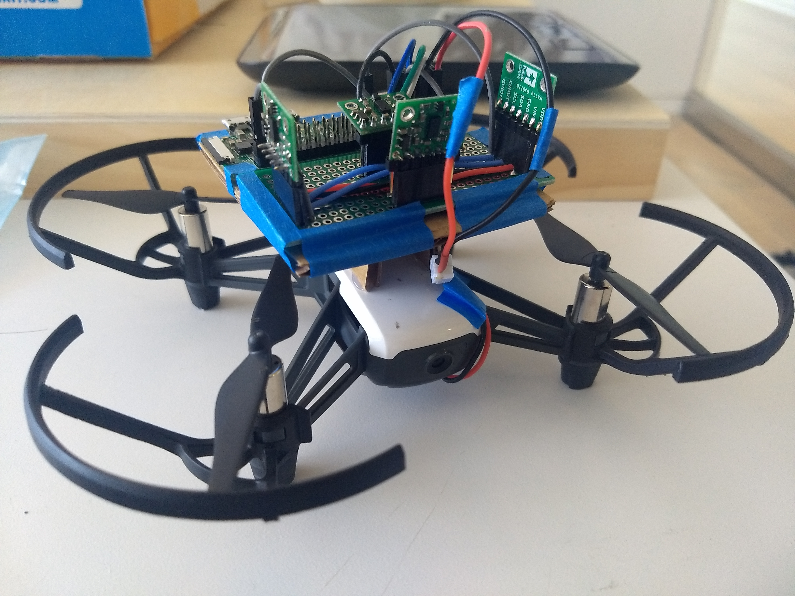
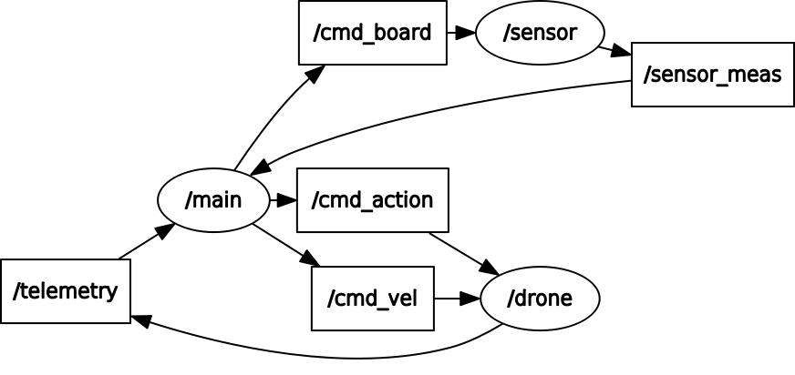
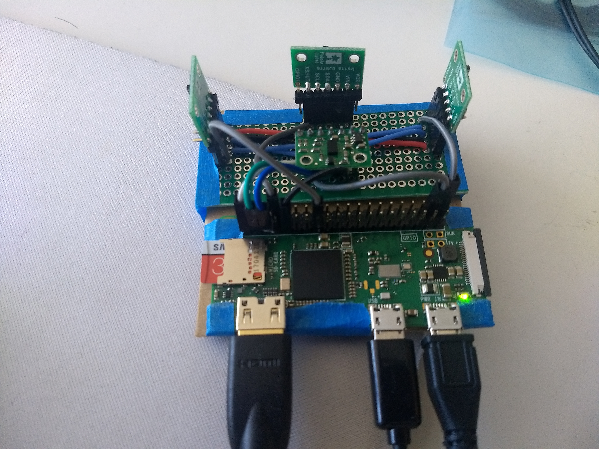
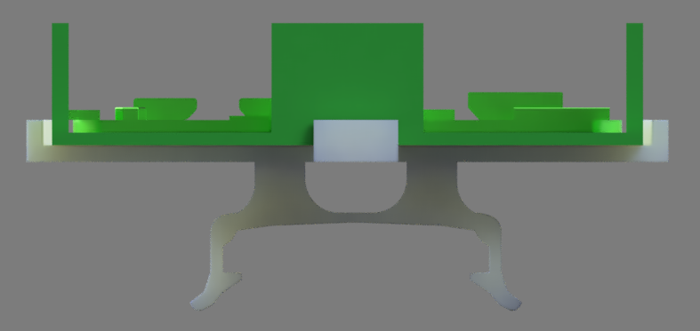

# Collision Avoidance for WiFi Drones



This project aims to extend the autonomous and safety capabilities of smaller and more affordable consumer drones (i.e. DJI Tello ~$100) with a lightweight (~33g), low-cost (~$30 excluding general tools) collision avoidance system. This is a modular system that can be mounted on any drone as long as either power can be shared between the two or the drone is large enough to carry an external battery for the sensor system.

The collision avoidance system utilizes multiple VL53L0X TOF sensors connected to a Raspberry Pi Zero W. Distance measurements are communicated over Bluetooth to a host computer. Simultaneously, the computer send actuation commands to the drone over its WiFi.

VL53L0X readings and drone IMU data (optional) are fused using a kalman filter.
A PD controller commands specific velocities to the drone.

### Tradeoffs

The Tello+battery weighs around 86g. With a 33g increase and extra power consumption from the sensor system, flight time by about 50%.
Control with an external controller has not been been implemented in this package.

## ROS nodes and topics



### Nodes

* `/main` connects to drone and sensor and runs control code using kalman and PID classes
* `/sensor` connects to PiZero via PyBluez and publishes sensor measurements
* `/drone` connects to Tello, handles protocol

### Topics

* `/cmd_vel` [geometry_msgs/Twist](http://docs.ros.org/melodic/api/geometry_msgs/html/msg/Twist.html)
* `/cmd_action` [std_msgs/String](http://docs.ros.org/melodic/api/std_msgs/html/msg/String.html)
* `/cmd_sensor` [std_msgs/String](http://docs.ros.org/melodic/api/std_msgs/html/msg/String.html)
* `/sensor_meas` [msg/sensor_meas](https://github.com/aaaaronlin/tello_collision_avoidance/blob/master/coll_avoid/msg/sensor_meas.msg)
* `/telemetry` [msg/telemetry](https://github.com/aaaaronlin/tello_collision_avoidance/blob/master/coll_avoid/msg/telemetry.msg)
* `/est` [msg/estimate](https://github.com/aaaaronlin/tello_collision_avoidance/blob/master/coll_avoid/msg/estimate.msg)

## Hardware Assembly

### Sensor System


Tools, hardware, and instructions: https://www.instructables.com/id/VL53L0X-Sensor-System/

## Software Setup

### Requirements

* Ubuntu 16.04 or 18.04 with ROS Kinetic or ROS Melodic respectively.
* Python 2.7
* Raspberry Pi Zero W with Raspbian

### Raspberry Pi:


```
sudo apt-get update
sudo apt-get install python-pip python-dev ipython build-essential

sudo apt-get install bluetooth libbluetooth-dev
```

VL53L0x Python Library: https://github.com/pimoroni/VL53L0X_rasp_python

```
cd your_git_directory
git clone https://github.com/pimoroni/VL53L0X_rasp_python.git
cd VL53L0X_rasp_python
make

```

PyBluez 0.22: https://github.com/pybluez/pybluez
```
sudo pip install pybluez=0.22
```


### Linux PC:

ROS Kinetic (for Ubuntu 16.04): http://wiki.ros.org/kinetic/Installation/Ubuntu

ROS Melodic (for Ubuntu 18.04): http://wiki.ros.org/melodic/Installation/Ubuntu

Tellopy (build from source): https://github.com/hanyazou/TelloPy

PyBluez 0.22: https://github.com/pybluez/pybluez
```
sudo apt-get install bluetooth libbluetooth-dev
sudo pip install pybluez=0.22
```


## Building The Repository


```
mkdir -p ~/catkin_ws_tello/src/

cd ~/catkin_ws_tello/src/

git clone https://github.com/aaaaronlin/tello_collision_avoidance/

cd ..

catkin build
```


## Setting up Wireless Communication

### PiZero

Enable Bluetooth

Disable WiFi (for interference purposes)

Running a script on startup:

copy /board/sensor_system.py to /Desktop on PiZero

change the bluetooth address to your PC address, as well as GPIO pins used

```
cd
sudo nano /etc/rc.local
```

add the line:

```
python2 /home/pi/Desktop/sensor_system.py &
```

This will allow the script to run automatically when the PiZero is externally charged by the drone battery.

### PC
Enable Bluetooth

Enable WiFi (for drone AP)

## Possible Future Endeavors

### Tello Mounting



Files are located in the 3D folder. Not tested.

### User Input

Allow user to controll the drone, using the sensors as a safety measure.

